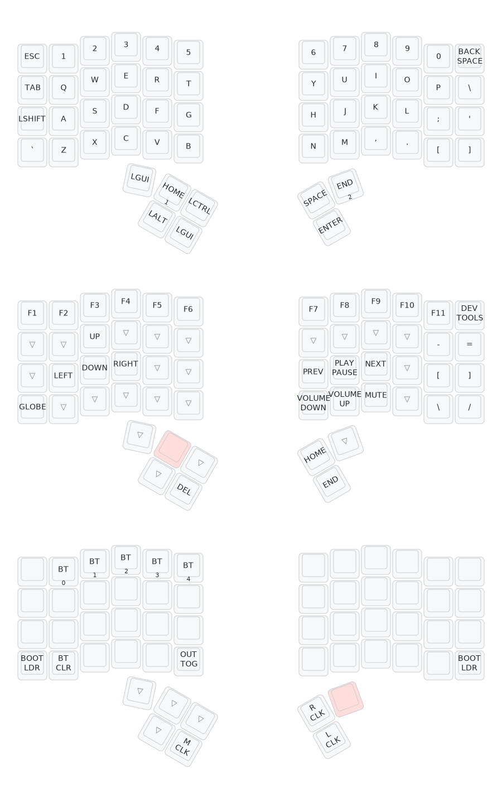

## Intro

This repository holds the ZMK firmware for a wireless Charybdis split keyboard with a PMW3610 trackball. It runs a customized QWERTY layout spread across three layers (see [Keymaps & Layers](#keymaps--layers)) and builds as a Bluetooth/USB configuration with the right half as the central.

Additionally, this repository automatically generates SVG images of all layers in the keymap, and adds it to the README. It also provides high level instructions and resources on how to customize and build the firmware to meet your specific needs.

Check out the [Charybdis Mini Wireless build guide](https://github.com/280Zo/charybdis-wireless-mini-3x6-build-guide?tab=readme-ov-file) if you haven't yet built your own Charybdis keyboard.

## Usage

If you'd like to use the pre-built firmware, the files are attached to each successful [Actions run](../../actions?query=branch%3Amain) — open the latest run on `main` and download the artifacts. See **[BUILD.md](BUILD.md)** for the full build-and-flash walkthrough. This repo builds three artifacts:

- **charybdis_qwerty_left** — left half (peripheral)
- **charybdis_qwerty_right** — right half (central; includes ZMK Studio support)
- **firmware_reset_nano_v2** — resets a controller's stored settings/pairings

There are a few things to note about how the pre-built firmware is configured:

- ZMK has terms for each side of a split keyboard. Central is the half that sends keyboard outputs over USB or advertises to other devices over bluetooth. Peripheral is the half that will only send keystrokes to the central once they are paired and connected through bluetooth. The Bluetooth/USB firmware uses the right side as central.
- The dongle firmware will have much better battery life for the central side, but requires an extra MCU and can only be connected through the dongle.
- The Bluetooth/USB firmware can connect through Bluetooth, but the central side will have a shorter battery life because it needs to maintain that connection.
  - The central side can also be plugged in to USB and the keyboard can be used when Bluetooth on the host computer isn't available (e.g. BIOS navigation)
- To add support for the PMW3610 low power trackball sensor, badjeff's [zmk-pmw3610-driver](https://github.com/badjeff/zmk-pmw3610-driver), [ZMK Input Behavior Listener](https://github.com/badjeff/zmk-input-behavior-listener?tab=readme-ov-file), and [ZMK Split Peripheral Input Relay](https://github.com/badjeff/zmk-split-peripheral-input-relay) modules are included in the firmware.
- eigatech's [zmk-configs](https://github.com/eigatech/zmk-config?tab=readme-ov-file) played a major role in getting badjeff's drivers and modules fully configured and are a great resource
- A separate branch builds the Bluetooth/USB firmware using [inorichi's driver](https://github.com/inorichi/zmk-pmw3610-driver?tab=readme-ov-file) as an alternative to badjeff's driver.
- Pete Johanson (creator and lead of the ZMK firmware) developed a feature ([pointers-move-scroll](https://github.com/zmkfirmware/zmk/pull/2027)) that allows mouse keys to move and scroll. A successor feature ([pointers-with-input-processors](https://github.com/zmkfirmware/zmk/pull/2477)) was then developed that allows more flexibility. This feature is what will eventually be merged into the main ZMK branch, and it's what is used by this repo to build the firmware. Although it's not guranteed to be stable, it hasn't caused any noticible issues. That being said, if you'd prefer to use pointers-move-scroll which is in a stable state, you can update the west.yaml and adapt the config files accordingly.

## Building & Flashing

For a step-by-step guide to building the firmware (GitHub Actions or a local
`west` build) and flashing it onto both halves, see **[BUILD.md](BUILD.md)**.
The quick flashing steps are below.

## Flashing the Firmware

Follow the steps below to flash the firmware

- If you are flashing the firmware for the first time, or if you're switching between the dongle and the Bluetooth/USB configuration, flash the reset firmware to all the devices first
- Unzip the firmware.zip
- Plug the right half info the computer through USB
- Double press the reset button
- The keyboard will mount as a removable storage device
- Copy the applicable uf2 file into the NICENANO storage device (e.g. charybdis_qwerty_dongle.uf2 -> dongle)
- It will take a few seconds, then it will unmount and restart itself.
- Repeat these steps for all devices.
- You should now be able to use your keyboard

> [!NOTE]  
> If the keyboard halves aren't connecting as expected, try pressing the reset button on both halves at the same time. If that doesn't work, follow the [ZMK Connection Issues](https://zmk.dev/docs/troubleshooting/connection-issues#acquiring-a-reset-uf2) documentation for more troubleshooting steps.

## Keymaps & Layers

This build has three layers. The diagram at the end of this section renders all three, stacked top to bottom: **Base**, **MOD**, and **BTMD**.

### Base

Standard QWERTY. A few keys differ from a stock layout: the outer-left key on the bottom row is `~`, `Backspace` sits at the top-right with `\` directly below it, and the bottom-right cluster is `, . [ ]`. The thumbs are `GUI · MO(MOD) · Ctrl · Space` on the upper row and `MO(BTMD) · Alt · GUI · Enter` on the lower row. The trackball moves the cursor.

### MOD — hold the `MO(MOD)` thumb key

Function and navigation layer. Holding it also switches the trackball from moving the cursor to **scrolling**.

- **F1–F12** across the top row.
- **Arrows** on `W` / `A` / `S` / `D`.
- **Media transport** on `H` / `J` / `K` — previous, play/pause, next.
- **Volume** on `N` / `M` / `,` — down, up, mute.
- A right-hand symbol block: `-` `+` above `[` `]`, plus `/`.
- **Home** and **End** on the `Space` and `Enter` thumb keys.
- Keys that aren't reassigned are transparent, so they fall through to the base layer while `MOD` is held.

### BTMD — hold the `MO(BTMD)` thumb key

Bluetooth and mouse layer. The trackball keeps moving the cursor here.

- **Bluetooth profiles** `BT 0`–`BT 4` on the number row; `BT CLR` clears the selected profile's pairing.
- **Output toggle** (USB/Bluetooth) and **bootloader** on the outer corners.
- **Mouse buttons** (left / middle / right click) on the thumb keys.

## Modify Key Mappings

### ZMK Studio

[ZMK Studio](https://zmk.studio/) allows users to update functionality during runtime. It's currently in beta, but the physical layout and updated config files are included in the BT/USB firmware for testing. The dongle firmware does not have this integration at the moment.

To change the visual layout of the keys, the physical layout must be updated. This is the charybdis-layouts.dtsi file, which handles the actual physical positions of the keys. Though they may appear to be similar, this is different than the matrix transform file (charybdis.json) which handles the electrical matrix to keymap relationship.

To easily modify the physical layout, or convert a matrix transform file, [caksoylar](https://github.com/caksoylar/zmk-physical-layout-converter) has built the [ZMK physical layouts converter](https://zmk-physical-layout-converter.streamlit.app/).

For more details on how to use ZMK Studio, refer to the [ZMK documentation](https://zmk.dev/docs/features/studio).

### Keymap GUI

Using a GUI to generate the keymap file before building the firmware is another easy way to modify the key mappings. Head over to nickcoutsos' keymap editor and follow the steps below.

- Fork/Clone this repo
- Open a new tab to the [keymap editor](https://nickcoutsos.github.io/keymap-editor/)
- Give it permission to see your repo
- Select the branch you'd like to modify
- Update the keys to match what you'd like to use on your keyboard
- Save
- Wait for the pipeline to run
- Download and flash the new firmware

### Edit Keymap Directly

To change a key layout choose a behavior you'd like to assign to a key, then choose a parameter code. This process is more clearly outlined on ZMK's [Keymaps & Behaviors](https://zmk.dev/docs/features/keymaps) page.

- Behaviors are all documented on the [Behaviors Overview](https://zmk.dev/docs/behaviors)
- Codes are all documented on the [keycodes](https://zmk.dev/docs/codes) page

Open the keymap file and change keys, or add/remove layers, then merge the changes and re-flash the keyboard with the updated firmware.

## Changing the Central and Peripheral Assignments

Follow the ZMK documentation [Kconfig.deconfig](https://zmk.dev/docs/development/new-shield#kconfigdefconfig) to change which keyboard half is the central and which is the peripheral. This does not apply to the dongle configuration.

## Changing the Keyboard Name

Follow the ZMK [Kconfig.defconfig](https://zmk.dev/docs/development/new-shield#kconfigdefconfig) section to update the keyboard name. Make sure to read about the danger in exceeding the 16 character limit.

## Building Your Own Firmware

ZMK provides a comprehensive guide to follow when creating a [New Keyboard Shield](https://zmk.dev/docs/development/new-shield). I'll touch on some of the points here, but their docs should be what you reference when you're building your own firmware.

### File Structure

When building the ZMK firmware, the files need to be located in the correct place. The formats and locations of the files can be found on ZMK's [Configuration Overview](https://zmk.dev/docs/config).

### Mapping GPIO Pins to Keys

To set up some of the configuration files it requires a knowledge of which keys connect to which pins on the MCU (see the [Shield Overlays](https://zmk.dev/docs/development/new-shield#shield-overlays) section), and how the rows and columns are wired.

To get this information, look at the PCB kcad files and follow the traces from key pads, to row and column through holes, to MCU through holes. Once you have that information you can update the applicable dtsi/overlay files.

## Creating Graphical Key Maps

This repo uses the excellent work of caksoylar's [Keymap Drawer](https://keymap-drawer.streamlit.app/) to automatically generate a key mapping of each layer when the Github Actions are run.

## Upcoming ZMK Features

ZMK is actively being developed and there are a few features that will be added to these builds if/when they are approved.

- Layer Lock - [Open PR](https://github.com/zmkfirmware/zmk/pull/1984)
- Unicode Support - [Issue](https://github.com/zmkfirmware/zmk/issues/232)

## Credits

- [eigatech](https://github.com/eigatech)
- [badjeff](https://github.com/badjeff)
- [inorichi](https://github.com/inorichi)
- [manna-harbour](https://github.com/manna-harbour)
- [nickcoutsos](https://github.com/nickcoutsos/keymap-editor)
- [Petejohanson](https://github.com/petejohanson)
- [caksoylar](https://github.com/caksoylar/keymap-drawer)